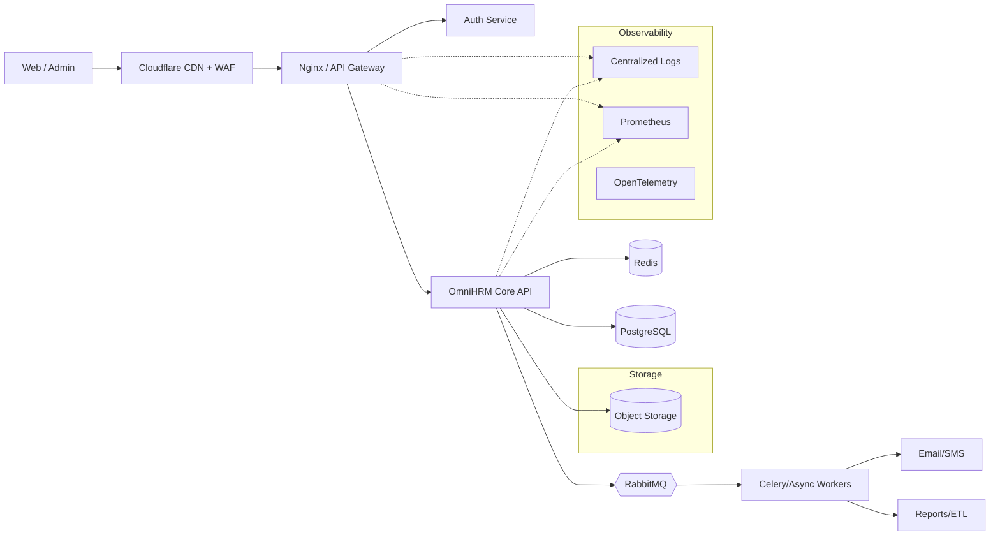
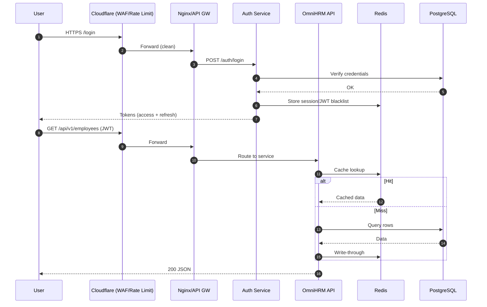
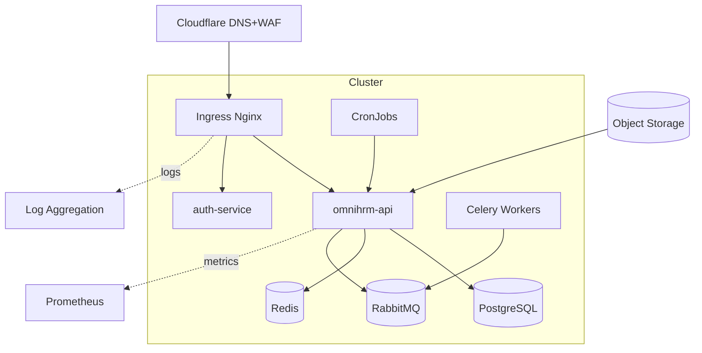

<div align="center">

# 👋 Hi There!  

### I'm Azim Hossain Tuhin

<a href="https://git.io/typing-svg"></a>

</div>

---

## ☕ About Me!

### 👨‍💻 Backend Engineer | Building Scalable & Secure Systems


Hello! I’m **Azim Hossain Tuhin**, a **Backend Engineer** focused on high-quality APIs, observability, and production reliability. I work primarily with **Python**, **Django/FastAPI**, **PostgreSQL**, **Redis**, **Nginx**, and **Docker/Kubernetes**—with **Cloudflare** at the edge for DNS, CDN, and WAF.

I’m currently building **OmniHRM**, a modular HR platform. I enjoy system design, performance tuning, and shaping robust CI/CD pipelines.

- 🔭 Current: **OmniHRM** (modular HR platform)
- 🌱 Learning: **React / Next.js** for admin consoles
- 🌐 Portfolio: **[azimhossaintuhin.com](https://azimhossaintuhin.com)**
- 📫 Email: **codecommerze@gmail.com**

<br clear="right"/>

---

## 🌐 Connect with Me!

<p>
  <a href="https://azimhossaintuhin.com" target="_blank">
    
  </a>
  <a href="https://github.com/azimhossaintuhin" target="_blank">
    
  </a>
  <a href="https://linkedin.com/in/azim-hossain-tuhin-938190287" target="_blank">
    
  </a>
  <a href="mailto:codecommerze@gmail.com" target="_blank">
    
  </a>
  <a href="https://fb.com/tuhin.1st" target="_blank">
    
  </a>
  <a href="https://instagram.com/tuhin.1st" target="_blank">
    
  </a>
</p>

📧 **Email:** codecommerze@gmail.com  
🌐 **Website:** [azimhossaintuhin.com](https://azimhossaintuhin.com)

---

## 💻 Frontend Technologies
<p>
  
  
  
  
  
  
</p>

---

## 💻 Backend Technologies
<p>
  
  
  
  
  
  
  
  
  
  
  
</p>

---

## 🛠️ Tools & Platforms
<p>
  
  
  
  
  
  
  
  
  
  
  
</p>

---

## 🏗️ Backend Architecture

### 1) High-Level System Topology


### 2) Auth & Request Lifecycle


### 3) Database ER (OmniHRM Core)
```mermaid
erDiagram
  USERS ||--o{ SESSIONS : has
  USERS ||--o{ USER_ROLES : has
  ROLES ||--o{ USER_ROLES : maps
  DEPARTMENTS ||--o{ EMPLOYEES : owns
  EMPLOYEES ||--o{ ATTENDANCE : logs
  EMPLOYEES ||--o{ PAYSLIPS : generates

  USERS { uuid id PK; varchar email UK; varchar password_hash; timestamptz created_at }
  ROLES { uuid id PK; varchar name UK }
  EMPLOYEES { uuid id PK; uuid user_id FK; uuid department_id FK; varchar status }
  ATTENDANCE { uuid id PK; uuid employee_id FK; date work_date; time check_in; time check_out }
  PAYSLIPS { uuid id PK; uuid employee_id FK; numeric gross; numeric net; timestamptz generated_at }
```

### 4) Containerized Deployment (K8s)


---

## 📦 Typical Project Structure
```text
omnihrm/
├─ apps/                # domain modules: auth, employees, payroll, attendance
├─ core/                # settings, db, cache, celery, logging
├─ api/                 # routers/schemas, versioning
├─ docs/                # diagrams, ADRs, OpenAPI
├─ ops/                 # Docker, k8s, terraform, helm
├─ tests/
└─ manage.py
```

## 🔐 Security & Best Practices
- Cloudflare WAF + rate limits; strict TLS; security headers (CSP/HSTS)
- JWT access/refresh, Redis blacklist for revoke
- Parameterized queries; migration discipline; RLS for multi-tenant modules
- Secrets via env/KMS; least-privilege IAM/RBAC

## 🚀 CI/CD
- GitHub Actions → tests → build → push image (GHCR/ECR/GCR) → deploy to K8s
- Database migrations gated by smoke tests
- Blue/green or canary deploys with auto-rollback

## ⚡ Performance
- Read-through & write-through caching with TTL + tag invalidation
- Async workers for long-running tasks (ETL, reporting, emails)
- Pagination, connection pooling, prepared statements, N+1 guards

## 📈 Observability
- OpenAPI docs (`/docs`)
- Prometheus metrics & Grafana dashboards
- JSON structured logs (Loki/ELK), distributed tracing (OTel)

---

## 📊 GitHub Statistics

<table>
<tr>
<td width="50%" valign="top">


</td>
<td width="50%" valign="top">


</td>
</tr>
</table>

### 🏆 GitHub Trophies


---

## 📈 Contribution Graph


---

## 📊 Summary Cards

<p>
  
  
</p>

---

### 🔥 Core Expertise

```typescript
const skills = {
  backend: ['Python', 'Django', 'FastAPI', 'PostgreSQL', 'Redis', 'Nginx'],
  devops: ['Docker', 'Kubernetes', 'Cloudflare', 'GitHub Actions'],
  frontend: ['React', 'Next.js', 'TypeScript'],
  specialties: [
    'REST/GraphQL API Design',
    'System Design & Scalability',
    'Performance Optimization',
    'Secure Software Delivery'
  ],
  learning: ['Microservices', 'Cloud Architecture', 'Advanced Observability']
};
```

---

### ⭐ Show Some Love!

**If my projects are helpful, consider dropping a star!** ⭐


---

**© 2025 Azim Hossain Tuhin | Built with ❤️ and ☕**
